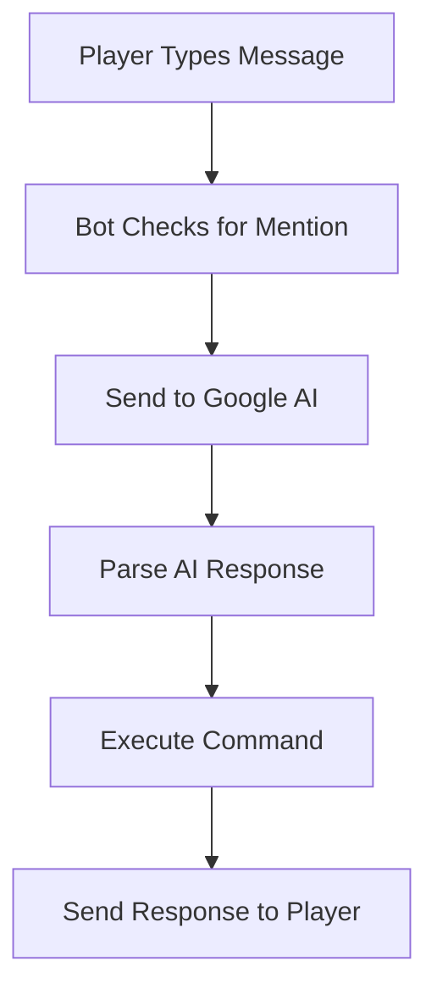

# Understanding the AI System in TreeBot

## How the AI Works

The AI system in TreeBot uses Google's Generative AI (Gemini) to understand player commands. Here's a detailed explanation:

## 1. Message Processing Flow



## Example 1: Finding Trees

When a player types: "TreeBot find me 3 oak trees"

1. **First Stage: AI Processing**
```javascript
// The AI receives this prompt:
`You are TreeBot, a Minecraft bot.
Available commands: findTrees, followPlayer, giveWood...
User message: "find me 3 oak trees"
Return a function call if this matches a command.`

// AI returns:
findTrees({"treeType": "oak", "maxCount": 3})
```

2. **Second Stage: Response Parsing**
```javascript
// The bot parses the AI response into:
{
    type: "command",
    command: "find trees",
    parameters: {
        treeType: "oak",
        maxCount: 3
    }
}
```

3. **Final Stage: Execution**
```javascript
// The bot executes the command:
await this.harvester.startHarvest({
    treeType: "oak",
    maxCount: 3
});
```

## Example 2: Following a Player

When a player types: "TreeBot follow me at distance 4"

1. **AI Processing**
```javascript
// AI Input:
"follow me at distance 4"

// AI Output:
followPlayer({"playerName": "PlayerName", "distance": 4})
```

2. **Command Execution**
```javascript
// The bot starts following:
this.movement.followPlayer(username, {
    distance: 4
});
```

## How to Add New Commands

1. **Add to bot-config.json**:
```json
{
    "capabilities": {
        "newCommand": {
            "name": "newCommand",
            "description": "Description of what it does",
            "command": "command name",
            "parameters": {
                "type": "object",
                "properties": {
                    "param1": {
                        "type": "string",
                        "description": "What this parameter does"
                    }
                }
            }
        }
    }
}
```

2. **Add Response Templates**:
```json
{
    "responses": {
        "newCommandResponse": [
            "I'll do the new command with {param1}!",
            "Starting new command, using {param1}"
        ]
    }
}
```

3. **Add Handler Function**:
```javascript
async handleNewCommand(params) {
    // Your code here
    console.log(`Executing with ${params.param1}`);
}
```

## AI Response Format

The AI always returns responses in one of these formats:

1. **Command Response**:
```javascript
{
    type: "command",
    command: "command_name",
    parameters: {
        // Command parameters
    },
    response: "Message to player"
}
```

2. **Conversation Response**:
```javascript
{
    type: "conversation",
    response: "Natural language response"
}
```

3. **Error Response**:
```javascript
{
    type: "error",
    response: "Error message"
}
```

## Common AI Patterns

1. **Finding Items**:
```
Player: "find X"
AI: findItem({"itemType": "X"})
```

2. **Quantities**:
```
Player: "get me 5 X"
AI: getItems({"itemType": "X", "amount": 5})
```

3. **Locations**:
```
Player: "go to X"
AI: moveTo({"location": "X"})
```

## Tips for AI Interaction

1. **Be Specific**:
   - Good: "find 3 oak trees"
   - Bad: "get some wood"

2. **Use Keywords**:
   - Good: "follow me at distance 5"
   - Bad: "come here"

3. **One Command at a Time**:
   - Good: "find oak trees"
   - Bad: "find oak trees and then follow me"

## Debugging AI Responses

If the AI isn't understanding commands, check:

1. **Console Output**:
```javascript
console.log('AI Response:', response);
// Shows what the AI understood
```

2. **Parameters**:
```javascript
console.log('Parsed parameters:', functionCall.parameters);
// Shows what parameters were extracted
```

3. **Command Matching**:
```javascript
console.log('Matched command:', capability);
// Shows which command was matched
```

Remember: The AI is trained to understand natural language but works best with clear, simple commands that match the patterns in bot-config.json.
